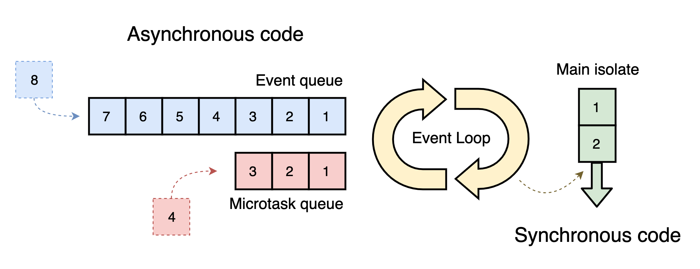

A simple command-line application.

Created from templates made available by Stagehand under a BSD-style
[license](https://github.com/dart-lang/stagehand/blob/master/LICENSE).

# Concurrency in Dart

Dart, in particular, is a single-threaded language. Dart's single thread runs in what is calls an **isolate**. Each isolate
has its own allocated memory area, which ensures that no isolate can access any other isolate's state. That means that
there's no need for a complicated locking system. It also means that sensitive data is much more secure. Such a system
greatly reduces the debugging and coding difficulty for a programmer.

For many tasks, order matters. For other tasks, though, the order doesn't matter. While some code needs to be executed in
order, other tasks can be temporarily postponed. The postponable tasks are where the Dart event loop comes in.

## The event loop

How does Dart manage to schedule tasks asynchronously? Dart uses what it calls an **event loop** to execute tasks that had
previously been postponed.

The event loop has two queues: a **microtask queue** and an **event queue**. The microtask queue is mostly used internally
by Dart. The event queue is for events like a user entering a keystroke or touching the screen, or data coming from a
database, file, or remote server. Have a look at the following image:



+ Synchronous tasks in the main isolate thread are always run immediately. You can't interrupt them.
+ If Dart finds any long-running tasks that agree to be postponed, Dart puts them in the event queue.
+ When Dart is finished running the synchronous tasks, the event loop checks the microtask queue. If the microtask queue
has any tasks, the event loop puts them on the main thread to execute next. The event loop keeps checking the microtask
  queue until it's empty.
+ If the synchronous tasks and microtask queue are both empty, then the event loop sends the next waiting task in the event
queue to run in the main thread. Once it gets there, the code is executed synchronously. Just like any other synchronous
  code, nothing can interrupt it after it starts.
  
+ If any new microtask enter the microtask queue, the event loop always handles them before the next event in the event
queue.
  
+ This process continues until all of the queues are empty.

## Running code in parallel

When people say Dart is single-threaded, they mean that Dart only runs on a single thread in the isolate. However, that
doesn't mean you can't have tasks running on another thread. One example of this is when the underlying platform performs
some work at the request of Dart. For example, when you ask to read a file on the system, that work isn't happening on the
Dart thread. The system is doing the work inside its own process. Once the system finishes its work, it passes the result
back to Dart, and Dart schedules some code to handle the result in the event queue. A lot of the I/O work from the
`dart:io` library happens in this way.

Another way to perform work on other threads is to create a new Dart isolate. The new isolate has its own memory and its
own thread working in parallel with the main isolate. The two isolates are only able to communicate through messages,
though. They have no access to each other's memory state. You won't often need to create a new isolate. However, if you
have a task that's taking too long on your main isolate thread, which you'll notice as unresponsiveness or jank in the UI,
then this work is likely a good candidate for handling it off to another isolate.

## The Future type

Dart has a type called `Future`, which is basically a promise to give you the value you really want later. Here's the signature
of a method that returns a future:
```dart
Future<int> countTheAtoms();
```
`Future` itself is generic; it can provide any type. In this case, though, the future is promising to give you an integer.
In your code, if you called `countTheAtoms`, Dart would quickly return an object of type `Future<int>`.

Behind the scenes, Dart has passed your request on to, presumably, an atom counting machine, which runs independently of
your main Dart isolate. When the atom counting machine finishes its work, it tells Dart and Dart puts the result, along
with any code you gave it to handle the result, on the event queue. (This is the first situation of running code in parallel).

## States for a future

Before a future completes, there isn't anything you can do with it, but after it completes it will have two possible results:
the value you were asking for, or an error. This all works out to three different states for a future:
+ Uncompleted

+ Completed with a value

+ Completed with an error

## Example of a future

One easy way to see a future in action is with the `Future.delayed` constructor.
```Dart
final myFuture = Future<int>.delayed(Duration(seconds: 1), () => 42);
```
Here's what's happening:
+ `myFuture` is of type `Future<int>`.

+ The first argument is a `Duration`. After a delay of 1 second, Dart will add the anonymous function in the second argument
to the event queue.
  
+ When the event loop gets to `() => 42` it will run that function in the main isolate, which results in the function
returning the integer 42.
  
In the future above, the value you really want is the 42, but how do you get it? Your variable `myFuture` isn't 42; it's
a future that's a promise to return an `int` or an error. You can see that if you try to print `myFuture`:
```Dart
print(myFuture);
```
The result is:
```
Instance of 'Future<int>'
```
There two ways to get the value after a future completes. One is with callbacks and the other is using the `async-await`
syntax.

## Getting the result with callbacks

A **callback** is an anonymous function that will run after some event has completed. In the case of a future, there are
three callback opportunities: `then`, `catchError` and `whenComplete`. Replace the body of the main function with the
following code:
```dart
print('Before the future');

final myFuture = Future<int>.delay(Duration(seconds: 1), () => 42)
                .then((value) => print('value: $value'))
                .catchError((error) => print('Error: $error'))
                .whenComplete(() => print('Future is complete'));
```
If it completes with a value, you can get the value by adding a callback to the `then` method. The anonymous function
provides the value as an arguments so that you have access to it. On the other hand, if the future completes with an error,
you can handle it in catchError. Either way, though, whether the future completes with a value or an error, you have the
opportunity to run any final code in `whenComplete`.

Run the code above to see these results:
```
Before the future
After the future
value: 42
Future is complete.
```
That `print` statement is synchronous, so it ran immediately. Even if the future didn't have a one-second delay, it
would still have to go to the event queue and wait for all the synchronous code to finish.

## Getting the result with async-await

Replace the entire `main` function with the following:
```dart
Future<void> main() async {
  print('Before the future');
  
  final value = await Future<int>.delayed(Duration(seconds: 1), () => 42);
  print('value: $value');
  
  print('After the future');
}
```
There are a few changes this time:
+ If a function uses the `await` keyword, then it must return a `Future` and add the `async` keyword before the funtion
body. Using `async` clearly tells Dart that this is an asynchronous function, and that the results will go to the event
  queue. Since `main` doesn't return a value, you use `Future<void>`.
  
+ In front of the future, you added the `await` keyword. Once Dart sees `await`, the rest of the function won't run until
the future completes. If the future completes with a value, there are no callbacks. You have direct access to that value.
  Thus, the type of the `value` variable above is not `Future`, but `int`.
  
Run the code above to see the following results:
```
Before the future
value: 42
After the future
```
This time, 'After the future' gets printed last. That's because **everything after the `await` keyword is sent to the event
queue**.